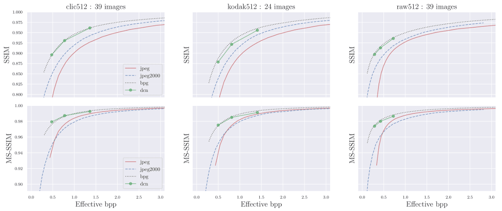
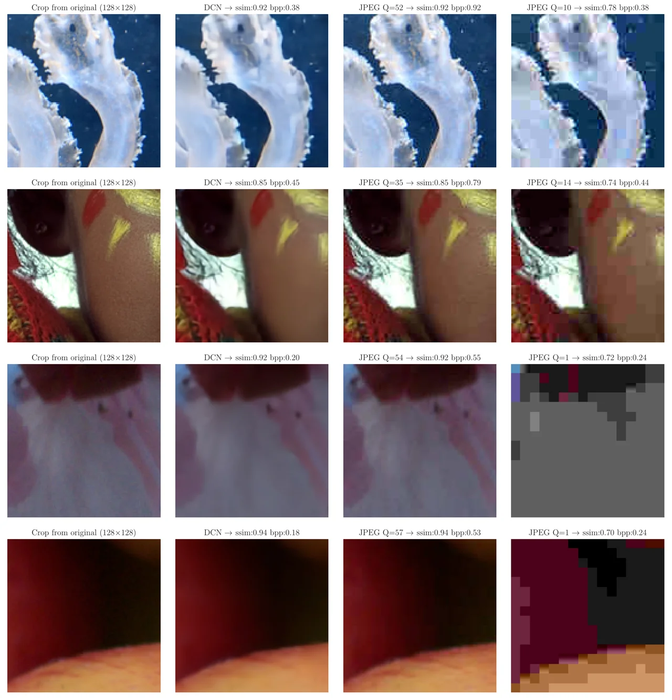

## Lightweight Learned Lossy Image Codec (l3ic)

Lightweight & high-performance learned image codec (Tensorflow) with rate-distortion performance close to BPG and ~5 fps encoding of HD-1080 images. 

This repository contains a deployed model only. For model definition, training scripts, etc. see my [neural imaging toolbox](https://github.com/pkorus/neural-imaging). For details, please refer to:

- P. Korus, N. Memon, *Quantifying the Cost of Reliable Photo Authentication via High-Performance Learned Lossy Representations*, ICLR'20, [openreview](https://openreview.net/forum?id=HyxG3p4twS)


> :warning: Note that this code is a research prototype and not a production-quality codec. Expect things to break in non-standard and edge cases. 

## Architecture at a Glance

- We used the auto-encoder architecture from [Liu et al. @CVPRW'18](https://arxiv.org/abs/1806.01496)
- We implemented our own quantizer and entropy estimator
- We don't use any normalizations (e.g., GDNs) & regularize only based on the entropy of the latent representation
- The deployed model uses a code-book with 32 values (integers from -15 to 16)
- We used a state-of-the-art entropy codec ([FSE](https://github.com/Cyan4973/FiniteStateEntropy))
- The latent representation is entropy-coded channel-wise - this brings savings as the images get larger and allows for random access to individual channels (may be useful e.g., when [doing vision directly on the latent representation](https://arxiv.org/abs/1803.06131))
- We control image quality using the number of latent channels (3 models with 16, 32 and 64 channels are provided)
- The included models were trained to minimize the (entropy-regularized) L2 loss on a dataset of 10,000 mixed natural patches (see paper for details)

## Installation

```bash
> git clone https://github.com/pkorus/l3ic
> cd l3ic
> pip3 install -r requirements.txt
> git submodule init
> git submodule update
> cd pyfse
> make
> cd ..
> python3 demo.py -m 32c
```

## Quality Benchmarks

Our codec delivers rate-distortion performance close to BPG. We show the rate-distortion trade-off for 3 different datasets for both SSIM and MS-SSIM (average on RGB channels):

- Validation images from the [CLIC/professional](https://www.compression.cc/) dataset (down-sampled to 512 px).
- Standard [Kodak images](http://r0k.us/graphics/kodak/) (cropped to 512 px).
- Random patches with native camera output (512 px; 4 cameras from [RAISE](http://loki.disi.unitn.it/RAISE/) and [MIT-5k](https://data.csail.mit.edu/graphics/fivek/)).



Example compression results (central 128 px crop) for our low-quality model are shown below. For comparison, we also show standard JPEGs with matching quality and payload.



## Speed Benchmarks

**TLDR:**

- In our experiments, l3ic was much faster than BPG, considerably faster than JPEG 2000 and much slower than JPEG.
- With mid-range server hardware (CPU & GPU) compressing a 1920 x 1080 RGB image takes 0.19 s & the corresponding decompression takes 0.17 s.
- Further runtime optimizations are possible, e.g., by parallelizing entropy coding (per-channels).

The code has not been particularly optimized, but still delivers competitive processing speed. It is significantly faster than some of the other models you can find online (e.g., [Mentzer et al. CVPR'18](https://github.com/fab-jul/imgcomp-cvpr) which is reported to require ~6 min for fairly small 768 x 512 Kodak images). With modern GPUs, the entropy codec starts to become the bottleneck - and we used one of the fastest things out there (the [FSE codec](https://github.com/Cyan4973/FiniteStateEntropy) from Yann Collet based on [asymmetric numeral systems](https://arxiv.org/abs/1311.2540) from Jarek Duda). Since latent channels are currently encoded separately, the problem could be trivially parallelized to further speed up processing.

**Standard codecs**

As a general reference, encoding a 1920 x 1080 px image using standard codecs takes approx. (n i7-7700 CPU @ 3.60GHz):
- JPEG with 1 thread takes between 0.061 s (Q=30) and 0.075 s (Q=90) [inclusive of writing time to RAM disk; *pillow* library]
- JPEG 2000 with 1 thread takes ~0.61 s regardless of the quality level [inclusive of writing time to RAM disk; *glymur* library]
- BPG with 4 parallel threads takes 2.4 s (Q=1), 1.25 s (Q=20) and 0.72 s (Q=30) [inclusive of PNG reading time from RAM disk; *bpgenc* command line tool].

**l3ic**

Average processing time on various platforms [in seconds] for 512 x 512 and 1920 x 1080 images. The numbers correspond to the medium quality model and were averaged over 39 images from the CLIC dataset (processed independently as batches of size 1). Encoding (E) and decoding (E) times include only neural network inference. Full compression (CE) and decompression (DE) include inference & entropy coding (bit-stream written to memory).

| GPU      | CPU                         | E-512  | D-512  | CE-512  | DE-512 | E-1080 | D-1080 | CE-1080 | DE-1080 |
| -------- | --------------------------- | ------ | ------ | ------ | ------ | ------ | ------ | ------ | ------ |
| Maxwell  | ARM 57 (nVidia Jetson Nano) | 0.2076 | 0.5333 | 0.6507 | 0.6721 | 1.6348 | 3.6057 | 4.4978 | 4.9722 | 
| -        | i7-7700 @ 3.60GHz           | 0.2165 | 0.3330 | 0.2272 | 0.3317 | 1.8052 | 2.7678 | 1.8753 | 2.7901 | 
| -        | i7-9770 @ 3.60Ghz           | 0.0648 | 0.1396 | 0.0762 | 0.1397 | 0.5197 | 1.1685 | 0.6080 | 1.1728 | 
| GF 1080  | Xeon E5-2690 @ 2.60GHz      | 0.0083 | 0.0173 | 0.0742 | 0.0498 | 0.0597 | 0.1244 | 0.1805 | 0.1714 | 
| P40      | Xeon E5-2680 @ 2.40GHz      | 0.0093 | 0.0160 | 0.0720 | 0.0375 | 0.0558 | 0.1123 | 0.1895 | 0.1684 | 
| V100     | Xeon E5-2680 @ 2.40GHz      | 0.0065 | 0.0071 | 0.0604 | 0.0209 | 0.0416 | 0.0489 | 0.1735 | 0.0979 | 
| GF 2080S | i7-9770 @ 3.60Ghz           | 0.0059 | 0.0132 | 0.0421 | 0.0244 | 0.0399 | 0.0953 | 0.1343 | 0.1320 |
